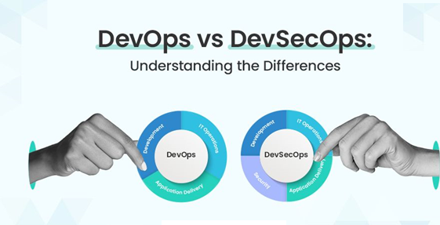
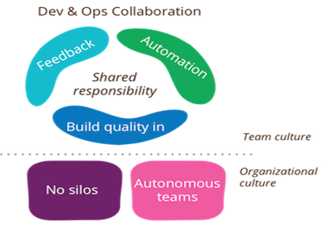
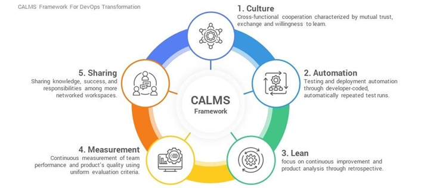

# DevOps-Fundamental
Understand DevOps Culture &amp; Principles (CI/CD, Automation, DevSecOps)

**DevOps and DevSecOps Fundamentals: A Technical Overview**

1. **Introduction to DevOps and DevSecOps**
This document provides a comprehensive overview of DevOps principles and practices, with a specific focus on the integration of security, known as DevSecOps. DevOps represents a cultural and operational shift aimed at unifying software development (Dev) and IT operations (Ops) to enable faster, more reliable, and more secure software delivery. DevSecOps extends this philosophy by embedding security considerations throughout the entire software development lifecycle (SDLC), transforming security from a late-stage gate into an integral, continuous process.
 

2. **DevOps Culture**

The foundation of DevOps is its culture, which emphasizes collaboration, shared responsibility, and continuous improvement across all teams involved in the software delivery process. Key cultural tenets include:

•**Collaboration and Communication**: Breaking down organizational silos between development, operations, quality assurance, and security teams. This fosters a unified approach where all stakeholders work towards common goals.

•**Shared Responsibility**: All teams collectively own the product from its inception through to production. This encompasses responsibility for functionality, performance, stability, and crucially, security.

•**Empathy**: Cultivating an understanding of the challenges and perspectives unique to each discipline (development, operations, security). This promotes constructive problem-solving and mutual support.

•**Feedback Loops**: Establishing rapid and continuous feedback mechanisms to enable quick identification of issues, facilitate learning from both successes and failures, and drive iterative improvements.

•**Blameless Post-Mortems**: When incidents occur, the focus shifts from assigning blame to understanding root causes and implementing preventative measures. This promotes a culture of psychological safety and continuous organizational learning.
 

3.**DevOps Principles**

DevOps practices are guided by established principles that ensure efficiency, quality, and adaptability. Two prominent frameworks define these principles: CALMS and The Three Ways.

3.1.**The CALMS Framework**

CALMS is an acronym representing five core components of DevOps:

•**Culture**: As detailed in Section 2, a collaborative and shared-responsibility mindset is paramount.

•**Automation**: The systematic automation of repetitive tasks across the entire SDLC, including build, test, deploy, monitoring, and security processes. Automation reduces human error and accelerates delivery.

•**Lean**: Application of lean manufacturing principles to software development, focusing on eliminating waste, optimizing workflow, and maximizing value delivery through small, frequent iterations.

•**Measurement**: Quantifying key performance indicators (KPIs) across the SDLC. Metrics such as build times, deployment frequency, mean time to recovery (MTTR), and security vulnerability detection rates provide insights for continuous optimization.

•**Sharing**: Promoting the open exchange of knowledge, tools, practices, and feedback across all teams. Transparency and open communication are critical for fostering a learning organization.
 
 

3.2. **The Three Ways of DevOps**
Derived from "The Phoenix Project," these principles describe the flow of work and information in a DevOps environment:

•**The First Way**: Flow (Left to Right): Focuses on accelerating the flow of work from development to operations. This involves breaking down large work batches into smaller, manageable units that move smoothly and rapidly through the value stream.

•**The Second Way**: Feedback (Right to Left): Emphasizes establishing fast, continuous, and clear feedback loops from operations back to development. This allows for rapid detection and remediation of issues (e.g., performance bottlenecks, functional errors, security vulnerabilities) in production.

•**The Third Way**: Continuous Learning and Experimentation: Promotes a culture of ongoing learning, experimentation, and continuous improvement. Organizations are encouraged to learn from system failures, adapt quickly, and innovate.

4. **Key DevOps Practices**
These principles are implemented through specific practices that form the backbone of a modern software delivery pipeline:

•**Continuous Integration (CI)**:

o**Definition**: Developers frequently merge their code changes into a shared central repository (e.g., Git). Each merge automatically triggers an automated build process and execution of a comprehensive suite of tests (unit tests, integration tests).

o**Benefits**: Early detection of integration issues, reduction of merge conflicts, immediate feedback on code quality and functionality, leading to a more stable codebase.

•**Continuous Delivery (CD) / Continuous Deployment**:

o**Continuous Delivery**: Ensures that code changes that pass all automated testing stages are always in a deployable state. Releases to production can be initiated at any time, though a manual approval step may still be present.

o**Continuous Deployment**: Automates the entire release process such that every code change that successfully passes all automated tests is automatically deployed to production without manual intervention.

o**Benefits**: Accelerated time-to-market, reduced risk per release due to smaller change sets, rapid iteration capabilities, and quicker recovery from potential issues.

•**Automation**:

o**Scope**: Automation is applied comprehensively across the SDLC, encompassing environment provisioning, test execution, application deployment, system configuration, monitoring, and self-healing mechanisms.

o**Infrastructure as Code (IaC)**: The practice of managing and provisioning infrastructure (servers, networks, databases, configurations) using machine-readable definition files (e.g., Terraform, Ansible). This ensures environment consistency, repeatability, and version control.

5. **DevSecOps: Integrating Security**
DevSecOps extends the DevOps philosophy by integrating security practices and considerations into every stage of the SDLC. Traditionally, security was a late-stage gate, often leading to discovering vulnerabilities late in the process, resulting in costly and time-consuming remediation. "Shifting Left" with security aims to proactively embed security from the initial planning and design phases through to operations and continuous monitoring.
This paradigm shift ensures that security is a shared responsibility across all teams, evolving from a reactive bottleneck to an enabling force that facilitates the secure, rapid delivery of software.

6. **DevSecOps in Practice**

Integrating security effectively within the DevOps pipeline involves several key practices:

•**Threat Modeling**: Conducting systematic analysis during the design phase to identify potential threats, vulnerabilities, and attack vectors. This proactive approach ensures security is considered architecturally from the outset.

•**Security by Design**: Ensuring that security principles are fundamental considerations in the architecture and design phase of applications and infrastructure, rather than being appended as an afterthought.

•**Static Application Security Testing (SAST)**: Automated analysis of source code, bytecode, or binary code to identify security vulnerabilities before the application is executed. SAST tools are typically integrated into CI build pipelines.

•**Dynamic Application Security Testing (DAST)**: Testing the application in its running state, often by simulating external attacks, to identify vulnerabilities that might only manifest at runtime. DAST tools are frequently integrated into CD pipelines or dedicated testing environments.

•**Software Composition Analysis (SCA)**: Identification and management of known vulnerabilities within open-source components, third-party libraries, and dependencies utilized in the application. Given the prevalence of open-source software, SCA is critical for supply chain security.

•**Infrastructure as Code (IaC) Security**: Automated scanning and validation of IaC templates to detect security misconfigurations, adherence to compliance policies, and insecure patterns prior to infrastructure provisioning.

•**Container Security**: Scanning container images for known vulnerabilities, misconfigurations, and adherence to security best practices. This includes runtime security for containerized applications.

•**Automated Security Gating**: Implementing automated checks within the CI/CD pipeline that can halt or prevent deployment if predefined critical security thresholds are breached (e.g., discovery of high-severity vulnerabilities).

•**Continuous Monitoring and Incident Response**: Post-deployment, continuous surveillance of applications and infrastructure for security anomalies, suspicious activities, and emergent vulnerabilities. Feedback from monitoring informs subsequent development and security enhancements.
The core objective is to provide developers with immediate, actionable security feedback, mirroring the rapid feedback loops established for code quality and functionality, thereby enabling quick and efficient vulnerability remediation.

7. **Benefits of DevSecOps**

The adoption of DevSecOps yields numerous tangible benefits:

•**Faster, More Secure Delivery**: Proactive vulnerability detection and remediation accelerate the delivery of secure software by minimizing late-stage security rework.

•**Improved Security Posture**: A significant reduction in the attack surface and overall organizational risk due to fewer vulnerabilities reaching production environments.

•**Reduced Costs**: The cost of fixing vulnerabilities dramatically increases the later they are discovered in the SDLC. DevSecOps facilitates early detection, leading to substantial cost savings.

•**Enhanced Compliance**: Built-in security controls, automated auditing, and comprehensive logging simplify the process of meeting regulatory and compliance requirements.

•**Higher Quality Software**: Security is an intrinsic quality attribute. Integrating security throughout the development process inherently leads to a more robust and higher-quality product.

•**Empowered Teams**: All team members contribute to the security of the product, fostering a pervasive security-conscious culture across the organization.

8. **Conclusion**
DevOps and DevSecOps represent continuous journeys of organizational and technical evolution rather than fixed destinations. Successful implementation requires unwavering commitment, patience, and a willingness to adapt. By embracing a collaborative culture, leveraging automation, and integrating security from the outset, organizations can achieve significant improvements in software delivery speed, reliability, and security posture.

